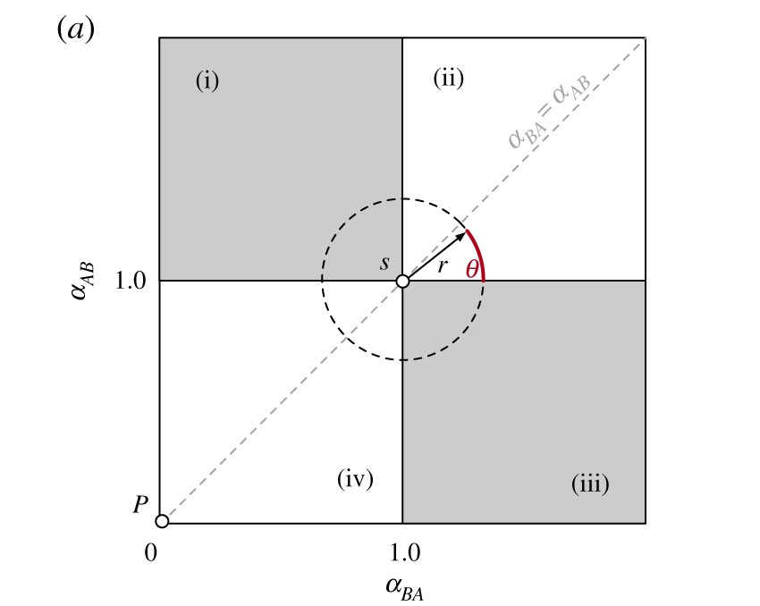

# ABM

## first iteration of the model is live!

To use the model, navigate to the folder `code` and run `visualize_model.py`.
The program will ask for an argument `tau`, which should be a float between 0 and 2 (and will be multiplied by $\pi$ by the program). (See explanation below) The visualization opens in a new window showing the grid of agents. Agents with opinion A are red and agents with opinion B are blue.

Tau is the angle between the chance of changing opinion from A to B and from B to A. This can be seen in the following image:

At $\tau = 0.25 \pi$, the system will converge to either A or B.
At $\tau = 0.75 \pi$, the system will converge to opinion A.
At $\tau = 1.25 \pi$, the system will not converge to one opinion.
At $\tau = 1.75 \pi$, the system will converge to opinion B.